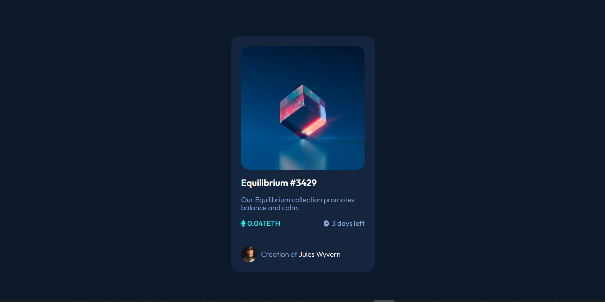

# equillibrium
Frontend Mentor - NFT preview card component
# Frontend Mentor - NFT preview card component solution

This is a solution to the [NFT preview card component challenge on Frontend Mentor](https://www.frontendmentor.io/challenges/nft-preview-card-component-SbdUL_w0U). Frontend Mentor challenges help you improve your coding skills by building realistic projects. 

## Table of contents

- [Overview](#overview)
  - [The challenge](#the-challenge)
  - [Screenshot](#screenshot)
  - [Links](#links)
- [My process](#my-process)
  - [Built with](#built-with)
  - [What I learned](#what-i-learned)
  - [Continued development](#continued-development)
- [Author](#author)

## Overview

### The challenge

Users should be able to:

- View the optimal layout depending on their device's screen size
- See hover states for interactive elements

### Screenshot

### Links

- Solution URL: [Equillibrium - GITHUB](https://github.com/Samjolas/equillibrium)
- Live Site URL: [Equillibrium - LIVE](https://samjolas.github.io/equillibrium)

## My process
- Evaluate the design 
- Look through the design with the design to out some measurement with Adobe Photoshop
- Decide on where to use flexbox or grid (I choose flexbox)
- Wrtie my first line of HTML and add Favicon
- Arrange my SASS, link my css to my html and test if my SASS is working well 
- Add all variable style and reset style 
- start coding the webpage 
- check for responsiveness 
- write README

### Built with

- Semantic HTML5 markup
- BEM METHODOLOGY
- CSS (SASS)
- flexbox
- CSS GRID
- Responsive Design

### What I learned

- While I was trying to create the active state of the nft image, I tried alot of procedures like using the after pseudo element and so on. 
After so many trial I decided to use the filter property and I achieved a similar result. 
I learnt that as a web deveoper you need to be very creative with your work, the ability to be able to predict how an object is been style is one skills I should have as a css developer. 

- I learnt the usefulness of using * {margin: 0; padding: 0;}; I created an unorderlist and notice the list had a default margin, have alot of trials I noticed that the issu was I did not had a default margin and padding at the beginning.

- After the feedback from a Frontend Mentor I decided to try out the the hover state using the pseudo class ::after and I achieved it. This was a great task. 

### Continued development

- Keep improving my css skills and also my JavaScript skills. 

- Code more often 

## Author

- Frontend Mentor - [@Samjolas](https://www.frontendmentor.io/profile/Samjolas)

